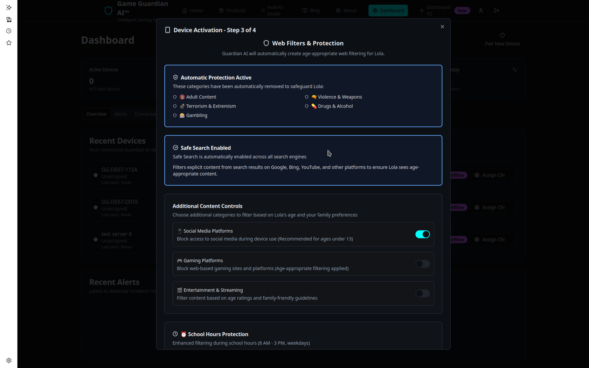
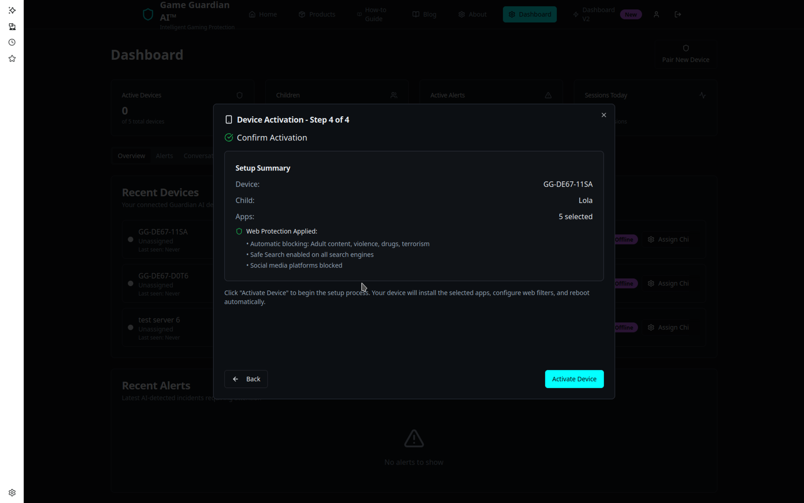

<p align="center">
  <strong>A privacy-focused Ubuntu distribution with AI-powered parental controls</strong>
</p>

<p align="center">
  
  
  
  
</p>

---

## 🌟 Why We Built Guardian OS

The internet wasn't designed with children in mind. Parents are stuck choosing between over-restricting their kids or letting them wander into unsafe spaces.  

Guardian OS changes that.  

We built it to give kids **a safe, fun, and empowering digital world**, while parents stay in control without having to hover.  

---

## 💡 What Guardian OS Does

Guardian OS combines the stability of **Ubuntu 24.04 LTS** with powerful **family protection features**.  

It creates a safe digital environment where children can learn, play, and grow — while parents can relax knowing that risks are managed in the background.  

---

## 🚀 Features & Benefits

🔒 **Smart Parental Controls**  
Easily create parent and child profiles with different settings. Parents see everything, kids only see what's safe.  
*Benefit: You stay in control without taking away independence.*  

🌐 **Safe Browsing, Built In**  
Harmful sites are blocked automatically using Guardian DNS / NextDNS filtering.  
*Benefit: Kids explore the web confidently without stumbling into unsafe corners.*  

🤖 **Reflex Real-Time Protection** *(optional)*  
AI-powered detection mutes, blurs, or blocks harmful content as it happens — from videos to chats.  
*Benefit: Children are shielded instantly, not after the fact.*  

🎮 **Family-Friendly App Store**  
Apps and games come with age ratings, safety warnings, and parent approval prompts.  
*Benefit: No more guesswork — you know what's safe before it's installed.*  

☁️ **Parent Cloud Dashboard**  
Check in from anywhere. Manage devices, set rules, approve apps, and monitor activity remotely.  
*Benefit: Peace of mind, even when you're not in the room.*  

⏰ **Screen Time & Routines**  
Set healthy daily limits, homework hours, or bedtime shutdowns.  
*Benefit: Builds balance and helps kids develop good digital habits.*  

🚨 **Alerts That Matter**  
Get notified if risky searches or unsafe behaviour is detected.  
*Benefit: You're kept in the loop without needing to micromanage.*  

📊 **Activity Insights**  
See how much time your child spends on games, learning apps, or browsing.  
*Benefit: Understand habits and encourage positive use of technology.*  

👤 **Portable Profiles**  
When kids log into another Guardian OS device, their safety settings come with them.  
*Benefit: Consistent protection — whether at home, school, or with family.*  

🔐 **Secure by Foundation**  
Built on Ubuntu 24.04 LTS, trusted worldwide for stability, privacy, and long-term support.  
*Benefit: Reliable, private, and future-proof.*  

---

## 📸 Screenshots

### Parent Dashboard (Web)

*Manage your family's digital safety from anywhere*

### Activity Monitoring

*Real-time insights into device usage and safety alerts*

### Desktop Experience

*A clean, familiar Ubuntu-based desktop tailored for families*

---

## 📦 Quick Start

### Build from Source

```bash
# Clone the repository
git clone https://github.com/jonnyweare/guardian-os-v1.git
cd guardian-os-v1

# Install build dependencies
sudo apt update
sudo apt install -y live-build debootstrap reprepro dpkg-dev \
    debhelper devscripts equivs curl gnupg2 jq

# Build the ISO
make iso
```

### Download Pre-built ISO

Download the latest release from the [Releases](https://github.com/jonnyweare/guardian-os-v1/releases) page.

## 🗏 Architecture

### System Components

- **Calamares Installer** - Custom modules for device registration
- **JWT Authentication** - Secure device-to-cloud communication
- **Systemd Services** - Heartbeat, parental controls, activation
- **APT Repository** - Signed packages for easy updates

### Package Structure

```
packages/
├── guardian-gnome-desktop    # GNOME meta-package
├── guardian-gnome-theme      # Branding and wallpapers
├── guardian-auth-client      # Authentication tools
├── guardian-device-agent     # Device management daemon
├── guardian-parental         # Parental control service
├── guardian-heartbeat        # Telemetry service
└── guardian-apps-base        # Core applications
```

## 🔐 Security

- **No API Keys on ISO** - Devices obtain JWT during installation
- **Hardware Fingerprinting** - Unique device identification
- **Encrypted Storage** - LUKS encryption by default
- **Secure Communication** - All API calls over HTTPS

## 🛠️ Development

### Building Packages

```bash
# Build individual package
cd packages/guardian-heartbeat
dpkg-buildpackage -b -uc -us

# Build all packages
make debs
```

### Testing

```bash
# Test in VM
qemu-system-x86_64 -m 4096 -cdrom guardian-os-*.iso -boot d

# Verify device registration
sudo cat /etc/guardian/supabase.env | grep JWT

# Check services
sudo systemctl status guardian-device-agent
sudo journalctl -u guardian-heartbeat
```

## 📡 API Integration

Guardian OS integrates with a Supabase backend for device management:

- **Authentication** - Parent login/registration
- **Device Claims** - Unique JWT per device
- **Heartbeats** - Regular status updates
- **Policy Sync** - Remote configuration updates

See [docs/API-INTEGRATION.md](docs/API-INTEGRATION.md) for details.

## 🤝 Contributing

We welcome contributions! Please see [CONTRIBUTING.md](CONTRIBUTING.md) for guidelines.

### Development Setup

1. Fork the repository
2. Create a feature branch
3. Make your changes
4. Test thoroughly
5. Submit a pull request

## 📄 License

Guardian OS is released under a **Personal Use License** — free for personal/educational use; **commercial use requires a license** from *We Are One 1 Limited*. See [`LICENSE`](./LICENSE) and [`TRADEMARKS.md`](./TRADEMARKS.md).

## 🆘 Support

- **Documentation**: [docs/](docs/)
- **Issues**: [GitHub Issues](https://github.com/jonnyweare/guardian-os-v1/issues)
- **Discussions**: [GitHub Discussions](https://github.com/jonnyweare/guardian-os-v1/discussions)
- **Website**: [gameguardian.ai](https://gameguardian.ai)

## 🙏 Acknowledgments

- Ubuntu and Canonical for the excellent base system
- GNOME Project for the desktop environment
- Calamares team for the installer framework
- Supabase for the backend infrastructure

---

<p align="center">
  Made with ❤️ by the Guardian OS Team
</p>
